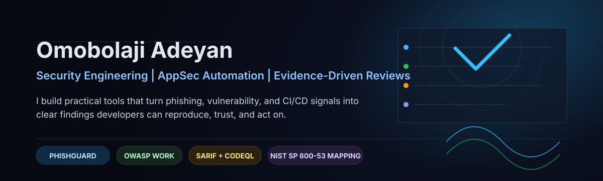
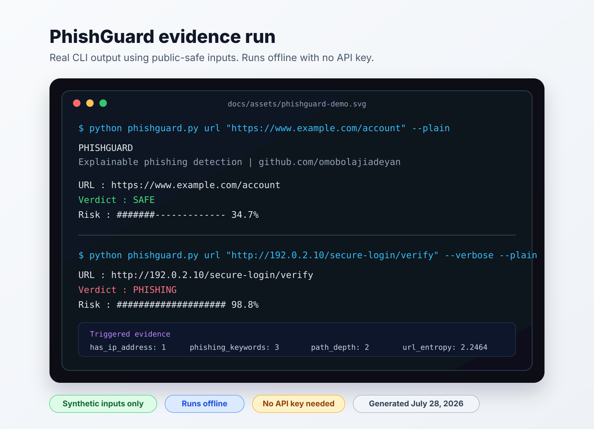

<div align="center">



<br />

<a href="https://github.com/marketplace/actions/phishguard-ai-phishing-detector">
  
</a>
<a href="https://owasp.org">
  
</a>
<a href="https://www.linkedin.com/in/oeadeyan">
  
</a>

</div>

---

## What I Stand For

Security work should be practical enough for engineers to adopt, precise enough for reviewers to trust, and clear enough for leaders to act on.

I build tools and contribute to open-source security projects where the output has to survive real scrutiny: phishing analysis, vulnerability triage, CI/CD hardening, SARIF reporting, policy mapping, and evidence trails that show how a finding was produced.

| Signal | What It Shows |
|---|---|
| [PhishGuard AI](https://github.com/marketplace/actions/phishguard-ai-phishing-detector) on GitHub Marketplace | I can take a security idea from implementation to packaged, reusable developer workflow |
| OWASP, Prowler, SecOps-NG, RamenDR work | I contribute inside established security communities and respond to maintainer standards |
| Security+, BS Information Technology | I connect hands-on engineering with governance, auditability, and risk language |

---

## Signature Project

### [PhishGuard AI](https://github.com/omobolajiadeyan/phishguard-ai)

PhishGuard AI is an explainable offline phishing detection engine for URLs and email. It is designed for local analysis, CI workflows, GitHub Code Scanning, and security education where black-box scoring is not enough.

```yaml
- uses: omobolajiadeyan/phishguard-ai@v0.5.1
```

<table>
  <tr>
    <td width="33%" valign="top">
      <strong>Explainable Detection</strong><br />
      URL, email, redirect, typosquatting, and authentication-signal analysis with readable reasoning.
    </td>
    <td width="33%" valign="top">
      <strong>Automation Ready</strong><br />
      JSON and SARIF 2.1.0 output for GitHub Code Scanning, CI workflows, and downstream tooling.
    </td>
    <td width="33%" valign="top">
      <strong>Trust Boundaries</strong><br />
      SPF, DKIM, and DMARC are treated as supporting evidence, not magic proof of safety.
    </td>
  </tr>
</table>

Recent work includes benchmark recall improvements, a stable Python API guide, SARIF validation, REST API server mode, third-party adoption templates, and expanded parser trust-boundary tests.

<p align="center">
  
</p>

<p align="center"><sub>Real CLI output on two public-safe inputs (<code>example.com</code> and the TEST-NET-1 documentation range) — see <a href="https://github.com/omobolajiadeyan/phishguard-ai/blob/main/docs/PROJECT_EVIDENCE.md">PROJECT_EVIDENCE.md</a> for the exact commands and a reproducible benchmark.</sub></p>

---

## Portfolio

<table>
  <tr>
    <td width="50%" valign="top">
      <h3><a href="https://github.com/omobolajiadeyan/phishguard-ai">PhishGuard AI</a></h3>
      <p>Offline phishing analysis with explainable scoring, SARIF output, Code Scanning support, and Marketplace packaging.</p>
      <p> </p>
    </td>
    <td width="50%" valign="top">
      <h3><a href="https://github.com/omobolajiadeyan/secrets-scanner">Secrets Scanner</a></h3>
      <p>CI-friendly credential scanner with redacted JSON/SARIF output and reusable GitHub Action support.</p>
      <p> </p>
    </td>
  </tr>
  <tr>
    <td width="50%" valign="top">
      <h3><a href="https://github.com/omobolajiadeyan/log-analyzer">Log Analyzer</a></h3>
      <p>Threat detection with MITRE ATT&amp;CK mappings, structured output, SARIF support, and security operations workflows.</p>
      <p> </p>
    </td>
    <td width="50%" valign="top">
      <h3><a href="https://github.com/omobolajiadeyan/behaviorsense">BehaviorSense</a></h3>
      <p>Behavioral anomaly detection for user and IP risk scoring, including UEBA-style insider-threat patterns.</p>
      <p> </p>
    </td>
  </tr>
  <tr>
    <td width="50%" valign="top">
      <h3><a href="https://github.com/omobolajiadeyan/vulngpt">VulnGPT</a></h3>
      <p>CVE analysis with NVD data and AI-assisted remediation guidance for faster vulnerability triage.</p>
      <p> </p>
    </td>
    <td width="50%" valign="top">
      <h3><a href="https://github.com/omobolajiadeyan/cve-dashboard">CVE Dashboard</a></h3>
      <p>Real-time CVE intelligence using NVD data, filtering, severity scoring, and trend tracking.</p>
      <p> </p>
    </td>
  </tr>
</table>

**Private pre-launch:** AppSec Compliance Bridge converts application-security scan findings into traceable NIST SP 800-53 control mappings and POA&M evidence.

---

## Open-Source Proof

| Area | Selected Evidence |
|---|---|
| Application security automation | [OWASP Agent Security Regression Harness PR #150](https://github.com/OWASP/Agent-Security-Regression-Harness/pull/150), [OWASP cve-lite-cli PR #602](https://github.com/OWASP/cve-lite-cli/pull/602) |
| Cloud and compliance security | [Prowler PR #11098](https://github.com/prowler-cloud/prowler/pull/11098), [SecOps-NG PR #281](https://github.com/secops-ng/secops-ng-framework/pull/281) |
| Supply-chain hardening | [RamenDR ramenctl PR #466](https://github.com/RamenDR/ramenctl/pull/466) |
| API and vulnerability tooling | PhishGuard API/server work, SARIF validation, Code Scanning hygiene |

Full dated record: [OPEN_SOURCE_LOG.md](OPEN_SOURCE_LOG.md)

---

## Writing

- [SPF, DKIM, and DMARC in Phishing Detection: Useful Signals, Not Magic Answers](https://dev.to/doidun2/spf-dkim-and-dmarc-in-phishing-detection-useful-signals-not-magic-answers-4g91)
- [From Single Files to Scenario Suites: Batch Validation in the OWASP Agent Security Regression Harness](https://dev.to/doidun2/from-single-files-to-scenario-suites-batch-validation-in-the-owasp-agent-security-regression-4hn7)
- [PhishGuard benchmark recall note](PHISHGUARD_BENCHMARK_RECALL_POST.md)

---

## Working Stack

<p align="center">
  
</p>

<p align="center">
  
  
  
  
  
</p>

---

## Contact

I am open to senior security engineering roles, application-security tooling collaboration, technical advisory work, and community projects around practical security automation.

<p align="center">
  <a href="https://omobolajiadeyan.com">Website</a> -
  <a href="https://www.linkedin.com/in/oeadeyan">LinkedIn</a> -
  <a href="https://dev.to/doidun2">Writing</a> -
  <a href="https://hackerone.com/doidun">HackerOne</a> -
  <a href="mailto:omobolaji.adeyan@gmail.com">Email</a>
</p>
